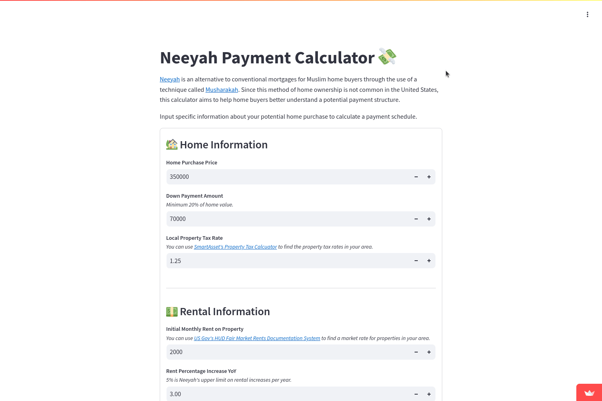

# Neeyah Payment Calculator
**TRY IT HERE: https://neeyah-calculator.streamlit.app/**

## About
[Neeyah](https://neeyah.com/) is an alternative to conventional mortgages for Muslim home buyers through the use of a technique called [Musharakah](https://en.wikipedia.org/wiki/Profit_and_loss_sharing#Musharakah). Since this method of home ownership is not common in the United States, this calculator aims to help home buyers better understand a potential payment structure.

This calculator is built using Python and uses the [Streamlit](https://docs.streamlit.io/) library to display the calculator in a user-friendly way. Users input specific information about your potential home purchase to calculate a payment schedule.

## Methodology
The payment calculator works in the following manner:

1. Users provide information about their potential home purchase. These values are: 
    - **Property Information:** Home value, down payment amount and the local property tax rate.
    - **Rental Information:** Initial rental rate for the property and a rental percentage increase YoY
    - **Home Value Growth:** Home value increase YoY and the amount of equity you would like to purchase YoY
2. At the beginning of every year (except the initial year):
    - The rental rate increases
    - The property value increases  
3. Every month, you pay:
    - You pay Neeyah's equity share of the rental rate
    - Your equity share of the property tax 
    - An equity payment equal to 5% of value of Neeyah's equity divided by 12 
4. Repeat steps 2 and 4 until you own 100% equity in the home

## Results
There are two dataframes that display the schedule. The simplified columns display the home value, equity shares, tax burden, monthly payment and rental payment information. The full set of columns displays the simplified values alongside the equity dollar values, equity rental split and equity tax splits.